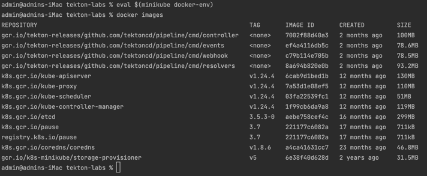

# Setting up a local CI/CD pipeline

Running Tekton CI/CD pipelines in a local Kubernetes cluster with minikube, and then deploying applications to Google Cloud Run, is a sophisticated process.
Below is a step-by-step walkthrough:

### Prerequisites

- `minikube` and `kubectl` installed
- Google Cloud SDK installed
- Docker installed
- Google Cloud account

## Setup steps

### 1. Start `minikube`

Start a `minikube` instance with the required resources:

<details>
<summary>Start the cluster with 2 CPUs amd 2048 MB memory</summary>

```shell
minikube start --cpus=2 --memory=2048
```

</details>

<details>
<summary>Start the cluster with 4 CPUs; Set the Kubernetes version; Attach a volume</summary>

```shell
export LOCAL_SOURCE_PATH="$HOME/Documents/00_code-repos/java17-spring-gradle-bigquery-reference"
```

```shell
minikube start \
  --cpus 4 \
  --kubernetes-version v1.24.4 \
  --mount-string $LOCAL_SOURCE_PATH:/data --mount \
  --mount-string ~/.config/gcloud:/data/.config/gcloud --mount
```

</details>

Check that the `minikube` instance was successfully created using `kubectl`.

If you haven't done so already, create the `tekton-pipeline` service account in GCP:

```shell
gcloud iam service-accounts create tekton-pipeline
```

### 2. Authenticate the `tekton-pipeline` service account for GCP Artifact Registry

```shell
gcloud projects add-iam-policy-binding \
  lofty-root-378503 \
  --member "serviceAccount:tekton-pipeline@lofty-root-378503.iam.gserviceaccount.com" \
  --role "roles/artifactregistry.writer"
gcloud iam service-accounts keys create \
  ./tekton-pipeline-key.json \
  --iam-account tekton-pipeline@lofty-root-378503.iam.gserviceaccount.com
```

### 2. Docker configuration

Next, prepare a Docker configuration file.

Typically, this is configured with `~/.docker/config.json`.
In the context of a Tekton pipeline, however, most of the time you wouldn't rely on the local `config.json` directly.
Instead, you'd use Kubernetes Secrets (e.g., a Tekton `Secret` named `regcred`) that Tekton Tasks can leverage to get the necessary authentication details.

The use of Kubernetes Secrets allows for a more secure, portable, and Kubernetes-native way of managing credentials.

```shell
{
  "auths": {
    "us-central1-docker.pkg.dev": {
      "auth": "BASE64_ENCODED_AUTH_STRING"
    }
  }
}
```

```shell
kubectl create secret generic regcred --from-file=.dockerconfigjson=/Users/admin/.docker/config.json --type=kubernetes.io/dockerconfigjson
```

For `BASE64_ENCODED_AUTH_STRING`, encode your service account email and the JSON key file:

```shell
EMAIL=tekton-pipeline@lofty-root-378503.iam.gserviceaccount.com
AUTH=$(echo -n "_json_key:$(cat $HOME/.config/gcloud/tekton-pipeline-key.json)" | base64)
```

Replace the `BASE64_ENCODED_AUTH_STRING` in your Docker configuration file with the value of `$AUTH`.

### 2. Enable Tekton pipelines

```shell
kubectl apply --filename https://storage.googleapis.com/tekton-releases/pipeline/latest/release.yaml
```

Wait a few minutes for the Tekton components to be deployed.

You can monitor the Tekton pipelines installation using the command:

```shell
kubectl get pods --namespace tekton-pipelines --watch
```

_Ctrl + C_ to stop monitoring.

### Install `Task` dependencies

**Git clone**

```shell
kubectl apply --filename https://raw.githubusercontent.com/tektoncd/catalog/main/task/git-clone/0.4/git-clone.yaml
```

**Kaniko**

```shell
kubectl apply -f https://raw.githubusercontent.com/tektoncd/catalog/main/task/kaniko/0.4/kaniko.yaml
```

**Gradle build**

```shell
kubectl apply --filename https://api.hub.tekton.dev/v1/resource/tekton/task/gradle/0.3/raw
```

or use the **Jib Gradle** task:

```shell
kubectl apply -f https://api.hub.tekton.dev/v1/resource/tekton/task/jib-gradle/0.4/raw
```

**Docker build**

```shell
kubectl apply --filename https://api.hub.tekton.dev/v1/resource/tekton/task/docker-build/0.1/raw
```

**Docker build and push**

```shell
kubectl apply -f https://api.hub.tekton.dev/v1/resource/tekton/task/kaniko/0.6/raw
```

### 3. Prepare Docker for Tekton

Tekton pipelines usually build Docker images.
Ensure your local Docker instance can be accessed by `minikube`:

```shell
eval $(minikube docker-env)
```

When this command is executed, you're essentially pointing your shell to the Docker daemon running inside your Minikube instance.
The output of the `minikube docker-env` command itself, when run without `eval`, provides a set of shell export commands that allow you to use the Docker client on your local machine to interact with the Docker service inside Minikube.

When you run it with `eval`, these exported commands are executed in the current shell.
Typically, you won't see much output directly from this command when used with `eval`.
However, if you run `minikube docker-env` without the `eval`, you'll see something like:

```shell
export DOCKER_TLS_VERIFY="1"
export DOCKER_HOST="tcp://192.168.99.100:2376"
export DOCKER_CERT_PATH="/home/user/.minikube/certs"
export MINIKUBE_ACTIVE_DOCKERD="minikube"
# Run this command to configure your shell:
# eval $(minikube docker-env)
```

The specific details (like IP addresses or paths) might differ based on your environment.
When you use `eval`, these variables are set in your current shell without any explicit output.

After running the `eval` command, you can check if it's working as expected by listing the Docker images inside the Minikube instance with:

```shell
docker images
```



You should see a list of images used by Minikube and any other images you've built within that environment.

If there's an error or if it's not pointing to the Minikube Docker daemon, you would see the images from your local Docker daemon instead (or get an error message if there's a connectivity issue).

### Revert the Docker environment variables back to local Docker daemon

<details>
<summary>Expand</summary>

Once you've finished working with Minikube and wish to revert Docker to point back to your local daemon (insetad of the Minikube's Docker daemon), you should reset the environment variables that were modified by the `eval $(minikube docker-env)` command.

Here's what you can do to revert the Docker environment variables back to your local Docker daemon:

  1. For **bash/zsh**:

     ```shell
     eval $(docker-machine env -u)
     ```
     
     or simply:

     ```shell
     unset DOCKER_TLS_VERIFY DOCKER_HOST DOCKER_CERT_PATH DOCKER_API_VERSION
     ```

  2. **For Powershell (Windows)**:

     ```shell
     & docker-machine env -u | Invoke-Expression
     ```
     
After running the above commands appropriate for your shell, your Docker client will point back to your local Docker daemon.

It's a good practice to revert your local Docker configuration after working with Minikube to avoid any confusion or unintended actions on the Minikube's Docker environment when you intended to work locally.

</details>

### 4. Authenticate for Google Cloud

```shell
gcloud auth login
gcloud auth configure-docker
```

Replace the following:

- `SERVICE_NAME` with the desired service name
- `IMAGE_URL` with a placeholder Docker image
- `REGION_NAME` with a preferred GCP region

### 5. Create secret for GCP Artifact Registry

```shell
kubectl create secret docker-registry regcred \
  --docker-server=us-central1-docker.pkg.dev \
  --docker-username=_json_key \
  --docker-password="$(cat /Users/username/.config/gcloud/sa-private-key.json)" \
  --docker-email=valid_email_address
```

**Example**

```shell
kubectl create secret docker-registry regcred \
  --docker-server=us-central1-docker.pkg.dev \
  --docker-username=_json_key \
  --docker-password="$(cat /Users/admin/.config/gcloud/sa-private-key.json | base64)" \
  --docker-email=morse.james.r@gmail.com
```

>Note: If you need to recreate the `regcred` secret you can delete the old one using the command:
>`kubectl delete secret regcred`

### 6. Create Tekton Tasks

   1. **Tag the Docker image**:

      ```shell
      docker tag \
        java17-spring-gradle-bigquery-reference \
        us-central1-docker.pkg.dev/lofty-root-378503/lofty-root-docker-test/java17-spring-gradle-bigquery-reference:latest
      ```

   2. **Build the Docker Image**:

      Create a `Task` that defines the steps to build a Docker image.

      ```shell
      docker build \
        --build-arg GCP_SA_KEY_PATH=/Users/admin/.config/gcloud/sa-private-key.json \
        --build-arg GCP_DEFAULT_USER_PROJECT_ID=lofty-root-378503 \
        --build-arg GCP_DEFAULT_USER_DATASET=test_dataset_integration \
        --build-arg GCP_DEFAULT_USER_TABLE=test_table_integration \
        -t java17-spring-gradle-bigquery-reference .
      ```

   3. **Push to Google Container Registry**:

      Create another `Task` that pushes the image to GCR.

      ```shell
      docker push us-central1-docker.pkg.dev/lofty-root-378503/lofty-root-docker-test/java17-spring-gradle-bigquery-reference:latest
      ```

   4. **Deploy to Cloud Run**:

      Define a third `Task` that takes the Docker image and deploys it to Cloud Run using `gcloud` commands.

      ```shell
      gcloud run deploy SERVICE_NAME \
        --image IMAGE_URL \
        --platform managed \
        --region REGION_NAME \
        --allow-unauthenticated
      ```

### 7. Create the Tekton Pipeline

Combine the tasks in a `Pipeline` to automate the CI/CD process.

<details>
<summary>YAML</summary>

### Example `Pipeline` (`build-and-push-pipeline.yaml`)

```yaml
apiVersion: tekton.dev/v1beta1
kind: Pipeline
metadata:
  name: build-and-push-pipeline
spec:
  params:
    - name: repoURL
      type: string
      description: The git repository URL
    - name: revision
      type: string
      description: The git revision
      default: "master"
    - name: IMAGE
      type: string
      description: Name (reference) of the image to build.
  workspaces:
    - name: shared-workspace
  tasks:
    - name: git-clone
      taskRef:
        name: git-clone
      workspaces:
        - name: output
          workspace: shared-workspace
      params:
        - name: url
          value: $(params.repoURL)
        - name: revision
          value: $(params.revision)
    - name: build-image
      taskRef:
        name: kaniko-task
      workspaces:
        - name: source
          workspace: shared-workspace
      params:
        - name: IMAGE
          value: $(params.IMAGE)
```

</details>

### 8. Create a `PipelineRun`

<details>
<summary>YAML</summary>

### Example `PipelineRun` (`pipeline-run.yaml)

```yaml
apiVersion: tekton.dev/v1beta1
kind: PipelineRun
metadata:
  generateName: build-and-push-pipelinerun-
spec:
  pipelineRef:
    name: build-and-push-pipeline
  params:
    - name: repoURL
      value: https://github.com/squidmin/java17-spring-gradle-bigquery-reference.git
    - name: revision
      value: "gcs-url-csv-upload"   # Change this if you want to build from another branch or commit
    - name: IMAGE
      value: us-central1-docker.pkg.dev/lofty-root-378503/java17-spring-gradle-bigquery-reference:latest
  workspaces:
    - name: shared-workspace
      persistentVolumeClaim:
        claimName: your-pvc-name  # Replace with the name of your PVC
```

</details>

### 8. Apply the `PersistentVolumeClaim`

```shell
kubectl apply -f PersistentVolumeClaims/pvc.yaml
```

### 8. Apply the Kaniko task

```shell
kubectl apply -f Tasks/kaniko-task.yaml
```

### 9. Apply the `Pipeline`

```shell
kubectl apply -f Pipelines/build-and-push-pipeline.yaml
```

### 9. Run the Tekton Pipeline

Create a `PipelineRun` resource to initiate the pipeline.

```shell
kubectl create --filename PipelineRuns/spring-boot-cicd-pipeline-run.yaml
```

### 10. Monitor the pipeline

Monitor the Tekton pipeline using `kubectl`:

```shell
kubectl get pipelinerun
```

<details>
<summary>Check the logs for any PipelineRun</summary>

```shell
tkn pipelinerun logs build-and-push-pipelinerun-xxxxx -f
```

</details>

<details>
<summary>Check the logs for any task</summary>

```shell
tkn pipelinerun logs <PIPELINERUN_NAME> -f
```

Example:

```shell
tkn pipelinerun logs build-and-push-pipelinerun-j29x4 -f
```

Replace `PIPELINERUN_NAME` with the actual name of your `PipelineRun`.

</details>

### 11. Access the deployed application

Once the pipeline completes, your application should be accessible on Cloud Run.
You can get the service URL from the Cloud Run dashboard.

>Note: The above steps are a high-level overview.
>Each step, especially creating Tekton `Tasks`, `Pipelines`, and the corresponding pipeline resources (git repo details, Docker registry credentials, etc.), will require detailed YAML configurations.
>You might also want to look into setting up `TriggerTemplates` and `EventListener` if you want to automate the CI/CD process based on events (e.g., a `git push`).
>Always refer to the official Tekton documentation for precise details and configurations.
